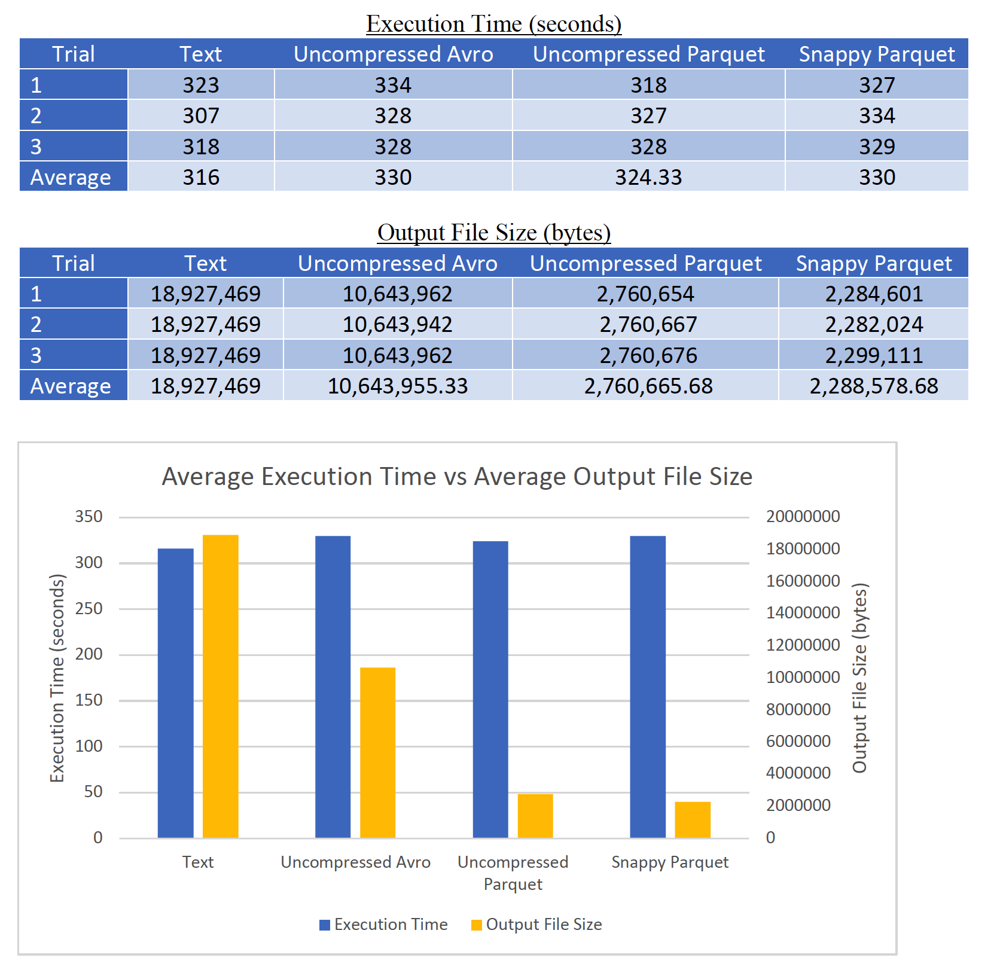
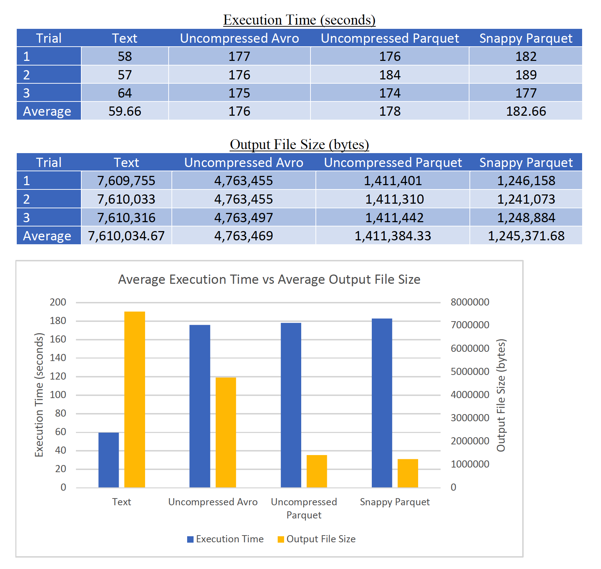

# Big Data Analytics

## Task Description

### This project was completed using **Python2.7** and **Spark 2.2.2**

For this project, the task was to perform duplicate detection by building an inverted index and calculating a similarity matrix for a document collection and save the output of each part in different file formats. Namely, the output files were saved into text, uncompressed Avro, uncompressed Parquet, and snappy Parquet file formats. A comparative analysis was then done to compare the different file format sizes in addition to the execution time taken to complete each of the parts.

Part 1:

a. Write a pyspark code to determine the 1,000 most popular
words in the document collection provided. Please ensure that
your code removes any special symbols, converts everything to
lower case (and if possible: remove stop words, destemming,
etc.).

Part 2:

a. Write a pyspark code to create an inverted index for the
1,000 words determined in Part 1. The inverted index is
supposed to be of the form

    term1: doc1:weight1_1, doc2:weight2_1, doc3:weight3_1,…
    term2: doc1:weight1_2, doc2:weight2_2, doc3:weight3_2,…

b. Measure the execution time of the code for the large data set
for 5, 10 and 15 executors

Part 3:
a. Write a pyspark code to calculate the similarity matrix S
with each entry of S being

    S(docx, docy) = SIGMA𝑡ϵ𝑉(𝑤𝑒𝑖𝑔ℎ𝑡𝑡_𝑑𝑜𝑐_𝑥 × 𝑤𝑒𝑖𝑔ℎ𝑡𝑡_𝑑𝑜𝑐_𝑦)

With V being the vocabulary (determined in part 1) and the
weights having been determined in part 2
b. 

Measure the execution time for the large data set for 5, 10,
and 15 executors 

## Usage

There is no need to specify the number of executors, executor cores, and executor memory as
they have been configured the same on each script with the following:

- Number of executors: 5
- Executor memory: 10g
- Executor cores: 4

Furthermore, the following the commands are generalized to work for parts A-D.

### Inverted Index Construction

    spark-submit –-master yarn path_to_script path_to_input_docs/* path_to_top_words/part-* path_for_output

### Similarity Matrix

    spark-submit –-master yarn path_to_script path_to_part2_output/part-* path_for_output

Where:

    path_to_script: is the path to the python script to be run
    path_to_input_docs: is the path to the document collection
    path_to_top_words: is the path to the output from part 1 with the top words
    path_to_part2_output: is the path to the output from part 2 with the inverted index
    path_for_output: is the path to where the output from the job will be written

## Resources Used
For this problem, I have made use of the university’s Whale cluster which has 50 compute nodes
where each node has two 2.2 GHz quad-core AMD Opteron processors, 16 GB of main memory,
and Gigabit Ethernet. The cluster also 144 port 4xInfiniBand DDR Voltaire Grid Director ISR
2012 switch, and a 7 TB Hadoop filesystem (HDFS). To access the cluster from outside of the
campus network, I used Cisco’s AnyConnect VPN client to be able to ssh into the Whale cluster.
For the development of the Spark applications, Spark 2.2.2 was used through PySpark with Python
2.7. As for the programming environment, I set up Spark locally and used Jupyter notebooks for
testing on a small collection of documents. I also used the Filezilla remote host tool to see the
contents of my remote directory, transfer my local Python scripts to the remote directory from
which they were executed, and view the results generated from the output of the Spark jobs. Lastly,
I have made use of the medium sized document collection.

## Measurements Performed
Three trials have been made for each of the parts A through D. In each trial, I am measuring both
the execution time and output file size for each of the parts while using 5 executors. As
mentioned above, each executor was allocated 3 cores with 10 GB of memory. I have then taken
the average execution time in seconds over the three trials as well as the average file size in bytes
while varying the file format in each of the four parts. Specifically, the file formats in question
are text, uncompressed Avro, uncompressed Parquet, and snappy Parquet.

## Results

### Inverted Index Construction

### Similarity Matrix

From the results in both the index construction and the computation of the similarity matrix,
there seems to be a tradeoff between execution time and the size of the output file when varying
the data formats. Although, this tradeoff is more pronounced in the computation of the similarity
matrix. Bringing our attention first to the execution time measurements, even though using all data
formats performed relatively the same during the index construction, using the text file format
performed much faster when measuring execution time for the computation of the similarity
matrix. A possible explanation to why this is could be because the data is read to an RDD directly
whereas, in the uncompressed Avro, uncompressed Parquet, and snappy Parquet versions, the data
is first read to a data frame and converted into an RDD. Then to write the output in the specified
format, the RDD is turned back to a data frame. Hence the similar average execution time
measurements for both uncompressed Avro and Parquet, and snappy Parquet versions.

Shifting our attention to the output file size measurements, the tradeoff mentioned earlier
can be seen in both the inverted index construction and computation of the similarity matrix. While
the text file versions were on average the fastest regarding execution time, it came at the cost of
the text file output having the highest space utilization. In contrast to this, snappy Parquet output
files, which were the version that on average took the longest execution time to complete, had the
least space utilization for storing both the inverted index and similarity matrix. Regarding space
utilization, storing the inverted index in a snappy Parquet format was eight times more efficient
than saving to a text file, and storing the similarity matrix in a snappy Parquet format was about
six times more efficient than storing it to a text file. Interestingly, the uncompressed Parquet output
files had a space utilization that was very similar to that of the snappy compressed output files.
Finally, the uncompressed Avro output files were on the middle ground when it came to reducing
the space utilization of the inverted index and similarity matrix. While the Avro output files were
a considerable improvement over text output files, they were not as space efficient as the
uncompressed or snappy compressed Parquet output files.

